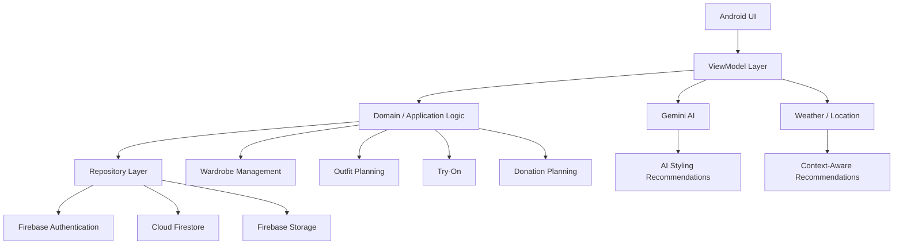

<div align="center">

# WardrobeAI

<p><b>An AI-powered Android wardrobe assistant for organizing clothes, discovering outfits, and getting personalized styling recommendations.</b></p>
<p>Android Application · Kotlin · Jetpack Compose · Firebase · Gemini AI</p>

<br>


<br><br>

<table align="center" width="85%">
  <tr>
    <td align="center">
      <h2>WardrobeAI</h2>
      <p>
        A smart digital wardrobe that combines AI-powered styling,<br>
        wardrobe organization, outfit planning and personalized recommendations.
      </p>
    </td>
  </tr>
</table>

<br>

<sub><em>WardrobeAI is an Android application focused on making digital wardrobe management and outfit discovery simple, personalized and intelligent.</em></sub>

</div>

---

## 📑 Table of Contents

<table width="100%">
<tr>
<td valign="top">

1. <a href="#1-overview">Overview</a><br>
2. <a href="#2-why-wardrobeai">Why WardrobeAI?</a><br>
3. <a href="#3-architecture">Architecture</a><br>
4. <a href="#4-end-to-end-wardrobe-flow">End-to-End Wardrobe Flow</a><br>
5. <a href="#5-key-capabilities">Key Capabilities</a><br>
6. <a href="#6-ai-integration">AI Integration</a>

</td>

<td valign="top">

7. <a href="#7-digital-wardrobe">Digital Wardrobe</a><br>
8. <a href="#8-ai-stylist">AI Stylist</a><br>
9. <a href="#9-outfit-planning">Outfit Planning</a><br>
10. <a href="#10-additional-features">Additional Features</a><br>
11. <a href="#11-project-structure">Project Structure</a><br>
12. <a href="#12-quick-start">Quick Start</a>

</td>

<td valign="top">

13. <a href="#13-firebase-configuration">Firebase Configuration</a><br>
14. <a href="#14-ai-api-configuration">AI API Configuration</a><br>
15. <a href="#15-security">Security</a><br>
16. <a href="#16-future-enhancements">Future Enhancements</a><br>
17. <a href="#17-author">Author</a>

</td>
</tr>
</table>

---

## 1. Overview

WardrobeAI is an Android application designed to transform a traditional wardrobe into an intelligent digital wardrobe.

The application allows users to:

- **✓** Organize clothing digitally
- **✓** Store clothing information and images
- **✓** Browse wardrobe items by category
- **✓** Get AI-powered outfit recommendations
- **✓** Interact with an AI styling assistant
- **✓** Plan outfits
- **✓** Manage outfits and wardrobe combinations
- **✓** Explore virtual try-on functionality
- **✓** Manage clothing donation planning
- **✓** Use personalized location and weather context
- **✓** Synchronize wardrobe data with Firebase

**Core idea:**

`WARDROBE → ORGANIZE → UNDERSTAND → RECOMMEND → PLAN → STYLE`

---

## 2. Why WardrobeAI?

Traditional wardrobe applications mainly focus on storing clothing items.

WardrobeAI extends this concept by combining wardrobe management with AI-assisted styling and personalized recommendations.

| Traditional Wardrobe App | WardrobeAI |
|---|---|
| Store clothing items | Store + intelligently organize clothing |
| Browse clothes manually | Browse a structured digital wardrobe |
| Static wardrobe | AI-assisted wardrobe experience |
| Manual outfit selection | AI outfit recommendations |
| Basic clothing information | Clothing information + contextual styling |
| Separate planning | Integrated outfit planning |
| Manual styling decisions | AI-assisted styling |
| Basic mobile interface | Modern Android UI |

---

## 3. Architecture



The application separates UI, state management, application logic and external services to keep the Android project maintainable and extensible.

---

## 4. End-to-End Wardrobe Flow

### 01 — ADD

The user adds clothing items to the digital wardrobe.

### 02 — ORGANIZE

Clothing items are stored with relevant information such as category, color, season and other attributes.

### 03 — ANALYZE

AI-powered functionality can use wardrobe information to understand clothing and styling context.

### 04 — RECOMMEND

The AI Stylist generates outfit suggestions based on the available wardrobe and user context.

### 05 — PLAN

Users can organize and plan outfits for different dates and occasions.

### 06 — EXPLORE

Additional wardrobe features such as Try-On and Donation Planning extend the digital wardrobe experience.

---

## 5. Key Capabilities

<table width="100%">
<tr>

<td width="50%" valign="top">

<b>Digital Wardrobe</b><br>
Organize and browse clothing items in a structured digital wardrobe.

<br><br>

<b>AI Styling</b><br>
Use Gemini-powered intelligence to generate personalized outfit recommendations.

<br><br>

<b>Clothing Management</b><br>
Maintain clothing information, images, categories and wardrobe metadata.

<br><br>

<b>Outfit Management</b><br>
Create and manage outfit combinations using wardrobe items.

<br><br>

<b>Personalized Recommendations</b><br>
Use wardrobe and contextual information to improve styling suggestions.

</td>

<td width="50%" valign="top">

<b>Outfit Planner</b><br>
Plan and organize outfits using the integrated planner.

<br><br>

<b>Virtual Try-On</b><br>
Provide a dedicated experience for exploring clothing combinations through the Try-On feature.

<br><br>

<b>Donation Planning</b><br>
Help users organize clothing items intended for donation.

<br><br>

<b>Firebase Integration</b><br>
Authentication, cloud data storage and image storage are handled through Firebase services.

<br><br>

<b>Modern Android UI</b><br>
Built using Kotlin and modern Android UI components including Jetpack Compose.

</td>

</tr>
</table>

---

## 6. AI Integration

WardrobeAI integrates **Google Gemini AI** to provide intelligent styling functionality.

The AI layer is designed around wardrobe context rather than generic recommendations.

### AI Styling Flow

```text
USER CONTEXT
      ↓
WARDROBE DATA
      ↓
AI REQUEST
      ↓
GEMINI
      ↓
OUTFIT RECOMMENDATION
      ↓
ANDROID UI
```

The application can provide context such as:

- Available wardrobe items
- Clothing characteristics
- User's styling request
- Weather/location context
- Desired outfit combinations

### AI Responsibility

The AI layer is responsible for generating styling-oriented recommendations while the Android application remains responsible for:

- User interaction
- Data management
- UI rendering
- Authentication
- Persistence
- Application state

---

## 7. Digital Wardrobe

The Digital Wardrobe is the central part of WardrobeAI.

Users can organize clothing items and browse their wardrobe through a dedicated mobile interface.

### Clothing Information

Depending on the item, the wardrobe can maintain information such as:

```text
Clothing Item
├── Image
├── Title
├── Description
├── Category
├── Color
├── Pattern
├── Size
├── Season
└── Usage Information
```

### Wardrobe Experience

The application provides a structured way to:

- Add clothing
- View clothing
- Edit clothing
- Organize clothing
- Browse categories
- Build outfits
- Use wardrobe items for AI recommendations

---

## 8. AI Stylist

The AI Stylist is one of the main intelligent features of WardrobeAI.

Users can describe what they want, for example:

```text
Suggest an outfit for a casual evening.
```

The application processes the request using the available wardrobe context and returns a styling recommendation.

### Example Flow

```text
User Request
     ↓
Wardrobe Context
     ↓
Gemini AI
     ↓
Styling Analysis
     ↓
Recommended Outfit
```

The goal is to make outfit discovery more conversational and personalized instead of requiring users to manually evaluate every possible clothing combination.

---

## 9. Outfit Planning

WardrobeAI includes an integrated planning experience for organizing outfits.

The planner can be used to associate outfit ideas with specific dates and wardrobe activities.

```text
WARDROBE
   ↓
OUTFIT
   ↓
PLANNER
   ↓
SCHEDULED LOOK
```

This provides a bridge between wardrobe organization and everyday outfit planning.

---

## 10. Additional Features

### Virtual Try-On

The Try-On section provides an interface for exploring clothing combinations and visualizing the wardrobe experience.

### Donation Planning

The Donation section helps users organize clothing items that they may want to donate.

### Weather & Location

Location and weather context can be used to make styling recommendations more relevant to the user's current conditions.

### Authentication

Firebase Authentication provides account-level access to the application.

### Cloud Synchronization

Wardrobe information can be synchronized with Firebase services, allowing application data to be persisted beyond a single local session.

---

## 11. Project Structure

```text
.
├── app/
│   ├── src/
│   │   └── main/
│   │       ├── java/com/example/wardrobeai/
│   │       │
│   │       ├── activities/          # Android activities
│   │       ├── adapters/            # RecyclerView / UI adapters
│   │       ├── closet/
│   │       │   └── main/             # Main application components
│   │       ├── di/                   # Hilt dependency injection
│   │       ├── firebase/             # Firebase integration
│   │       ├── helpers/              # Utility/helper classes
│   │       ├── models/               # Application data models
│   │       ├── preferences/          # User preferences
│   │       ├── ui/                   # Compose UI components
│   │       ├── views/                # Application screens
│   │       └── weather/              # Weather/location functionality
│   │
│   └── src/main/res/                 # Android resources
│
├── gradle/
│   └── libs.versions.toml            # Dependency versions
│
├── build.gradle.kts
├── settings.gradle.kts
├── gradle.properties
├── gradlew
└── README.md
```

---

## 12. Quick Start

### 1. Clone the repository

```bash
git clone https://github.com/allknowledge34/WardrobeAI.git
cd WardrobeAI
```

### 2. Open the project

Open the project in **Android Studio**.

Recommended:

```text
Android Studio
Kotlin
Android SDK
```

### 3. Sync Gradle

Allow Android Studio to download and configure all required dependencies.

### 4. Configure API Keys

Create a local `local.properties` file and add the required API keys.

Example:

```properties
sdk.dir=/Users/yourname/Library/Android/sdk

MAPS_API_KEY=YOUR_MAPS_API_KEY
GEMINI_API_KEY=YOUR_GEMINI_API_KEY
REMOVE_BG_API_KEY=YOUR_REMOVE_BG_API_KEY
```

Do not commit this file to GitHub.

### 5. Build the application

```bash
./gradlew assembleDebug
```

### 6. Run

Connect an Android device or start an Android Emulator and run:

```bash
./gradlew installDebug
```

---

## 13. Firebase Configuration

WardrobeAI uses Firebase services for application backend functionality.

### Firebase Services

```text
Firebase
├── Authentication
├── Cloud Firestore
└── Cloud Storage
```

### Android Firebase Setup

Place the Firebase configuration file here:

```text
app/google-services.json
```

The Firebase Android application should use the package:

```text
com.example.wardrobeai
```

After adding the Firebase configuration, synchronize the project with Gradle.

---

## 14. AI API Configuration

WardrobeAI uses Gemini AI for AI-powered styling functionality.

The API key should be provided locally through:

```properties
GEMINI_API_KEY=YOUR_GEMINI_API_KEY
```

The application reads the key through the Android build configuration.

### Important

Never commit API keys to:

- GitHub
- README files
- Source code
- Screenshots
- Public documentation

Use local configuration or a secure backend when appropriate.

---

## 15. Security

WardrobeAI follows a configuration-based approach for sensitive API credentials.

### Security Practices

- API keys are stored outside source-controlled Kotlin files.
- `local.properties` should remain untracked.
- Firebase configuration should be appropriately restricted.
- Google API keys should use application/API restrictions.
- Production applications should avoid exposing unrestricted credentials.

### Recommended `.gitignore`

```text
local.properties
*.jks
*.keystore
```

---

## 16. Future Enhancements

The following features can further extend WardrobeAI:

- AI-powered wardrobe de-cluttering recommendations
- Duplicate clothing detection
- Seasonal wardrobe analysis
- Clothing pairing analysis
- Automated garment background removal
- Automatic clothing categorization
- Color detection
- Improved camera-based garment capture
- More realistic digital wardrobe interactions
- Personalized style profiles
- Occasion-aware outfit recommendations
- Improved virtual try-on
- Advanced wardrobe analytics
- Offline-first AI assistance
- More detailed outfit history and usage insights

---

## 17. Author

**Sachin Kumar**

B.Tech Computer Science & Engineering

### Project

**WardrobeAI — AI-Powered Digital Wardrobe & Styling Assistant**

Built with:

```text
Kotlin
Android
Jetpack Compose
Firebase
Gemini AI
Hilt
```

---

<div align="center">

### WardrobeAI

<p>Organize your wardrobe. Discover your style. Let AI help.</p>

</div>
